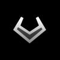

# Geometry Wars

---

## Краткая характеристика
* Наименование программы: **Geometry Wars** - компьютерная игра в жанре аркадного шутера
* Назначение программы: Развлечение
* Конечные пользователи: все, кто смогут запустить

# Техническое задание
Разработать игровое приложение на языке Python с использованием возможностей библиотеки [**Arcade**](https://api.arcade.academy/en/stable/)

# Сборка и запуск
Разработка и тестирование программы осуществлено в операционной системе **Manjaro Linux (Arch)**

[//]: # (Manjaro Linux 26.0.1 Anh-Linh)

## Файловая структура проекта
```text
в разработке :)
```

Для успешного запуска и нормальной работы в операционной системе должны быть установлены следующие **компоненты**:

* Язык **Python 3.13.11**
* Библиотека **arcade 2.6.1** (Sep 29, 2024)

# Игровой процесс
Игрок управляет кораблём на игровом поле, представляющее собой прямоугольную арену

Цель игры - набрать максимальное количество очков и выжить в условиях нарастающего действия противников

## Игрок


Управление осуществляется по клавишам WASD. Двигаясь, игрок уклоняется от противников и может их расстреливать по клавишам стрелок

[//]: # (Возможна интеграция геймпада)

Столкновение с противником приводит к уничтожению корабля и сбросу множителя очков.\
В уровнях, где есть система жизней, игра завершается при утрате всех жизней от контакта с противником

## Враги
В игре имеется несколько видов других геометрических фигур:
* **Розовый квадрат** - хаотично движущаяся фигура по полю; медлителен
* **Фиолетовое колесо** - хаотично движущаяся фигура по полю; средняя скорость перемещения
* **Синий квадрат** - преследующая игрока фигура
* **Зелёный ромб** - преследующая игрока фигура; уклоняется от пуль игрока
* **Дыра** - гравитационная фигура, засасывающая в себя все остальные фигуры;\
             при переполнении взрывается и высвобождает маленькие треугольники, преследующие игрока с большой скоростью

[//]: # (Позже тут будут картики)

## Вооружение
У игрока есть 2 способа устранить противников:


### Пули
Бесконечны. Каждая выстреленная пуля убивает 1 фигуру 

### Бомба
Ограничены. При использовании бомбы, испускается волна с текущей позиции игрока, убивающая все фигуры на поле 

# Игровой интерфейс
```text
в разработке :)
```
