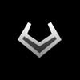

# Geometry Wars

---

## Краткая характеристика
* Наименование программы: **Geometry Wars** - компьютерная игра в жанре аркадного шутера
* Назначение программы: Развлечение
* Конечные пользователи: все, кто смогут запустить

# Техническое задание
Разработать игровое приложение на языке Python с использованием возможностей библиотеки [**Arcade**](https://api.arcade.academy/en/stable/)

# Сборка и запуск
Разработка и тестирование программы осуществлено в операционной системе **Manjaro Linux (Arch)**

[//]: # (Manjaro Linux 26.0.1 Anh-Linh)

## Файловая структура проекта
```text
[arcade]                # Директория приложения
├── [pic]               # Изображения
├── [sfx]               # Звуки
├── boosts.py           # Множители
├── enemies.py          # Файл с классами врагов
├── GameOverScreen.py   # Экран завершения игры
├── highscores.txt      # Текстовый файл с лучшим результатом игры
├── loaded_music.py     # Все загруженные звуки и музыка для уровней
├── main.py             # Точка входа - основная программа
└── main_menu.py        # Экран меню и настроек
└── particles.py        # Частицы
└── README.md           # Документация к игре
└── requirements.txt    # Список внешних зависимостей
```

Для успешного запуска и нормальной работы в операционной системе должны быть установлены следующие **компоненты**:

* Язык **Python 3.14**
* Библиотека **arcade 3.3.3** (Oct 9, 2025)

# Игровой процесс
Игрок управляет кораблём на игровом поле, представляющее собой прямоугольную арену

Цель игры - набрать максимальное количество очков и выжить в условиях нарастающего действия противников

## Игрок


Управление осуществляется по клавишам WASD. Двигаясь, игрок уклоняется от противников и может устранять их по клавишам стрелок

[//]: # (Возможна интеграция геймпада)

Столкновение с противником приводит к уничтожению корабля.\
В уровнях, где есть система жизней, игра завершается при утрате всех жизней от контакта с противником

## Враги
В игре имеется несколько видов других геометрических фигур:
* **Розовый квадрат** - хаотично движущаяся фигура по полю; медлителен
* **Фиолетовое колесо** - хаотично движущаяся фигура по полю; средняя скорость перемещения
* **Синий квадрат** - преследующая игрока фигура
* **Зелёный ромб** - преследующая игрока фигура; уклоняется от пуль игрока

[//]: # (Позже тут будут картики)

## Вооружение
У игрока есть 2 способа устранить противников:


### Пули
Бесконечны. Каждая выстреленная пуля убивает 1 фигуру 

### Бомба
Ограничены. При использовании бомбы, испускается волна с текущей позиции игрока, убивающая все фигуры на поле

Бомбы даются с увеличением числа очков.
Иногда бомба не задевает врага, это фича :)

# Игровой интерфейс

## Стартовое окно


## Настройки


## Игровое поле


## GameOver
